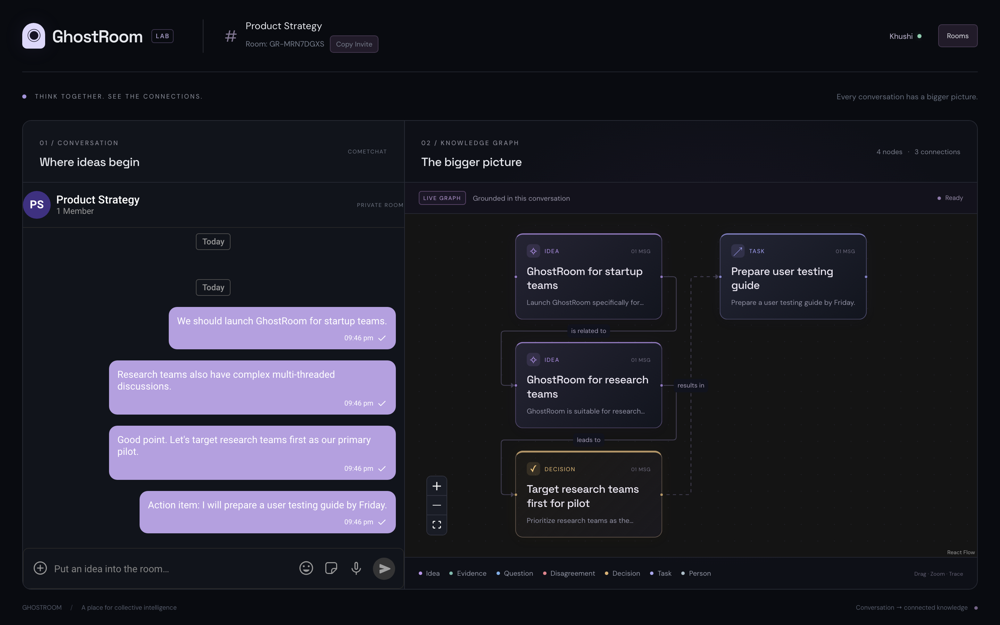
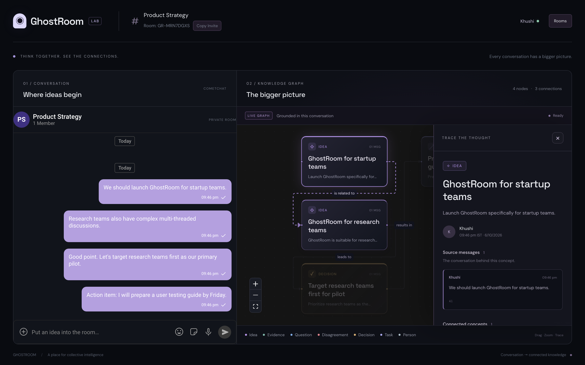
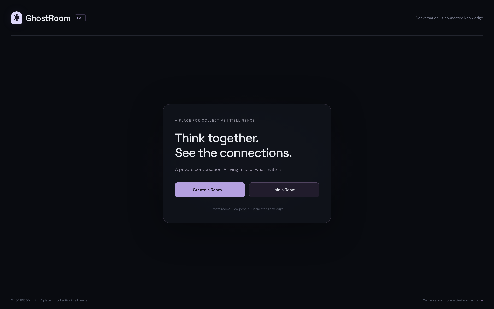
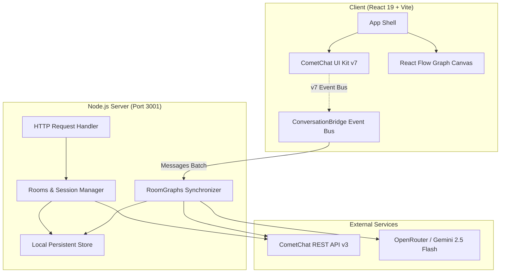

# ◉ GhostRoom

> **Think together. See the connections.**  
> A real-time collaborative workspace pairing private **CometChat** group conversation with a living, AI-generated **Knowledge Graph**.

[](https://ghostroom-gl54.onrender.com)
[](https://www.cometchat.com)
[](https://react.dev)
[](https://www.typescriptlang.org)
[](https://vitejs.dev)

---

## 📸 Screenshots

### 1. The Workspace (Chat + Living Knowledge Graph)
As team members discuss ideas in real time, GhostRoom extracts structured concepts, decisions, and disagreements into a synchronized visual graph on the right.



---

### 2. Trace the Thought (Grounding & Provenance)
Every node in the graph is strictly grounded in the conversation. Click any card to inspect its exact source message citations, author, timestamp, and connected ideas.



---

### 3. Quick Room Creation & Joining
Create a private room in seconds, share an 8-character invite code (`GR-XXXXXX`), and collaborate with real CometChat identities.



---

## 🌟 Key Features

- **🚀 Dynamic Private Rooms:** Create instant private rooms identified by short, shareable codes (e.g. `GR-FXWF69BT`). Each room maps deterministically to a private CometChat group.
- **💬 Real-Time CometChat v7 Messaging:** Powered by `@cometchat/chat-uikit-react` (v7) and `@cometchat/chat-sdk-javascript` (v4). Supports real-time text chat, threads, presence indicators, and live participant rosters.
- **🧠 Living AI Knowledge Graph:** Interactive canvas powered by **React Flow** (`@xyflow/react`) that continuously updates as the conversation flows.
- **🏷️ 7 Concept Types:**
  - `💡 Idea` — New proposals and hypotheses
  - `🔍 Evidence` — Supporting facts, data, and references
  - `❓ Question` — Open inquiries and blockers
  - `⇄ Disagreement` — Conflicting perspectives and debates
  - `✓ Decision` — Resolved outcomes and agreements
  - `📋 Task` — Action items and assignments
  - `👤 Person` — Active participants and contributors
- **🔗 Verified Provenance:** Zero hallucinated nodes. Every concept maintains stable IDs and bidirectional links to the underlying source messages.
- **🔄 Multi-User Synchronization:** All room participants share the same server-backed knowledge graph state, updated with debouncing and serialized queues.
- **🛡️ Secure Token-Based Auth:** Backend issues ephemeral CometChat user accounts and auth tokens with HttpOnly session cookies. Secrets remain strictly on the server.

---

## 🏗️ System Architecture



---

## 🛠️ Tech Stack

| Layer | Technology |
|---|---|
| **Frontend** | React 19, TypeScript, Vite 8, React Flow (`@xyflow/react`), DOMPurify |
| **Chat & Presence** | CometChat React UI Kit v7.2.3, CometChat JavaScript SDK v4.2.0 |
| **Backend** | Node.js (HTTP / ESM), TypeScript (`tsx`), Zod v4 |
| **AI Extraction** | OpenAI-compatible API (Google Gemini 2.5 Flash Lite via OpenRouter) |
| **Testing** | Playwright (multiplayer browser tests), Node.js native test runner |
| **Deployment** | Render (Web Service Blueprint), Docker / Node runtime |

---

## 🚀 Getting Started

### Prerequisites

- **Node.js** v20+ 
- **npm** v10+
- A [CometChat](https://www.cometchat.com/) account (App ID, Region, REST API Key)
- An AI provider API key (OpenRouter, OpenAI, or compatible endpoint)

### 1. Clone & Install

```bash
git clone https://github.com/khushi-infinity/GhostRoom.git
cd GhostRoom
npm install
```

### 2. Environment Configuration

Create `server/.env` with your server credentials:

```dotenv
# Server API Port
API_PORT=3001

# CometChat Server Credentials (Never exposed to client)
COMETCHAT_APP_ID=your_cometchat_app_id
COMETCHAT_REGION=in
COMETCHAT_REST_API_KEY=your_cometchat_rest_api_key

# AI Provider Configuration (OpenAI-compatible)
AI_API_KEY=your_openrouter_or_openai_api_key
AI_BASE_URL=https://openrouter.ai/api/v1
AI_MODEL=google/gemini-2.5-flash-lite
```

> **Security Note:** Neither CometChat REST keys nor AI API keys are exposed to the client bundle. The browser receives only ephemeral session tokens issued by the backend.

### 3. Run Locally

```bash
npm run dev
```

This starts:
- **API Server:** `http://127.0.0.1:3001`
- **Vite Web App:** `http://localhost:5173` (proxies `/api` to 3001)

Open `http://localhost:5173` in your browser to start creating rooms.

---

## 🧪 Testing & Verification

GhostRoom includes comprehensive unit and end-to-end integration tests:

### Backend Unit Tests
Runs 17 regression tests covering parsing, deduplication, schema validation, and room session isolation:
```bash
npm test
```

### Full Multiplayer Playwright Test
Runs a 2-user real-time test (Khushi + Alex) in isolated browser contexts verifying room creation, code join, real-time messaging, participant presence, and synchronized knowledge graph emergence:
```bash
npx playwright test tests/multiplayer.spec.ts --browser=chromium
```

### Linting & Production Build
```bash
npm run lint    # OxLint
npm run build   # TypeScript typecheck + Vite client bundle
```

---

## 🌐 Production Deployment

GhostRoom is pre-configured for **Render** via [`render.yaml`](render.yaml):

1. Fork or push this repository to GitHub.
2. Link the repository on [Render](https://dashboard.render.com/) as a **Blueprint** or **Web Service**.
3. Supply the environment variables in the Render dashboard:
   - `COMETCHAT_APP_ID`
   - `COMETCHAT_REGION`
   - `COMETCHAT_REST_API_KEY`
   - `AI_API_KEY`
   - `AI_BASE_URL`
   - `AI_MODEL`
4. Deploy! Render will build and serve the application as a unified full-stack service with built-in SPA routing and health check monitoring.

---

## 📄 License

MIT License. Designed and built for the collective intelligence hackathon.
